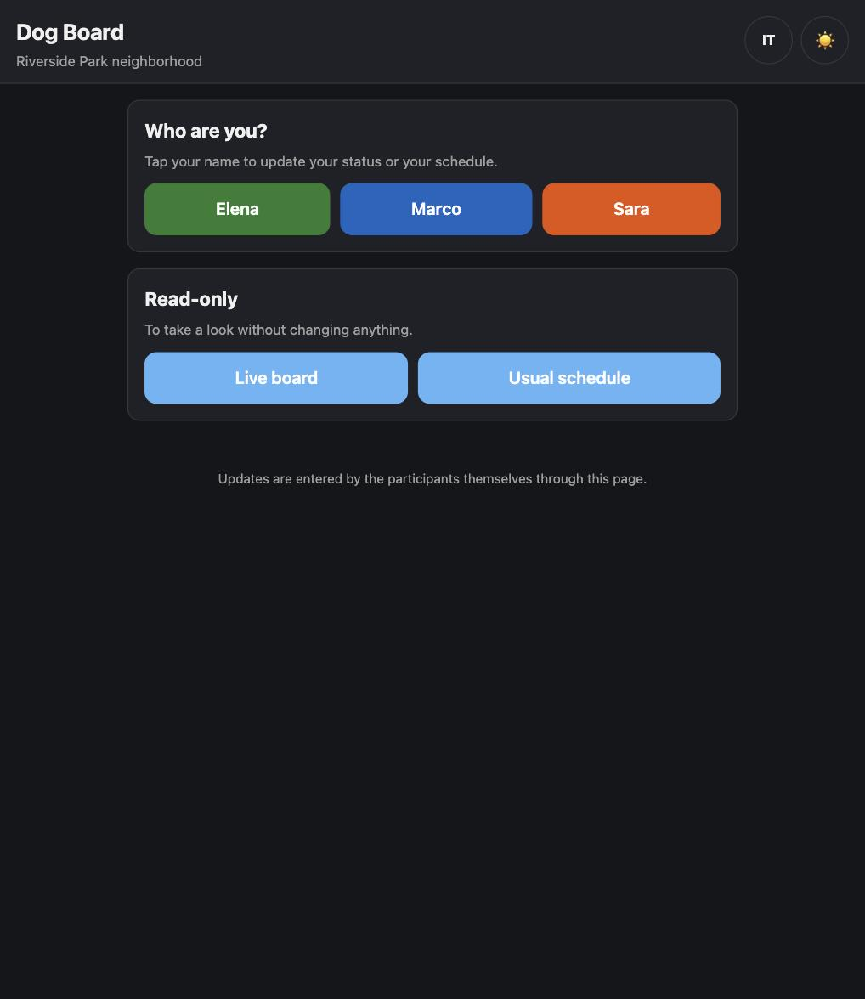
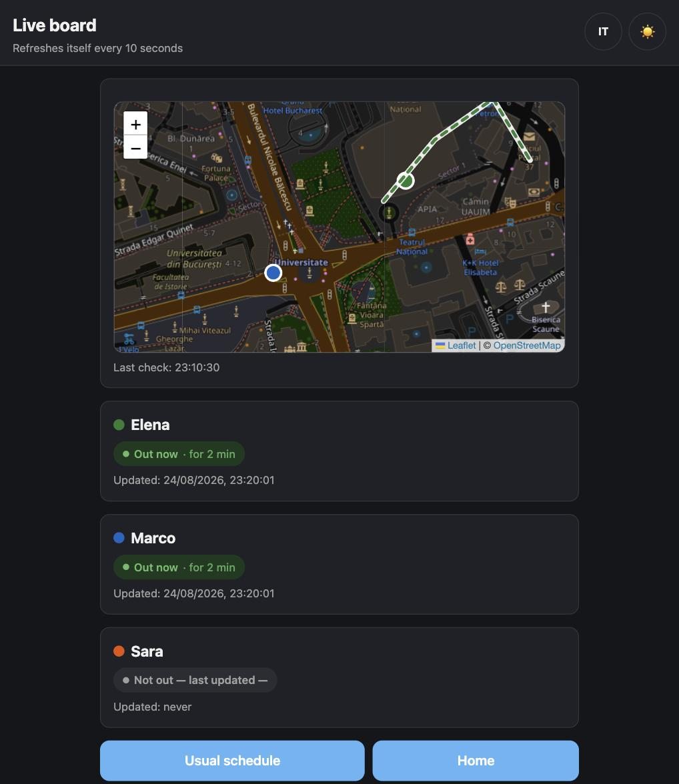
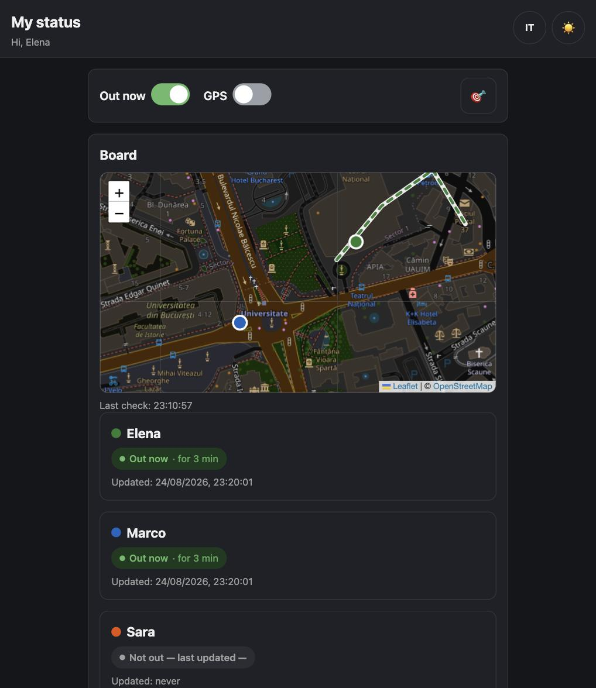
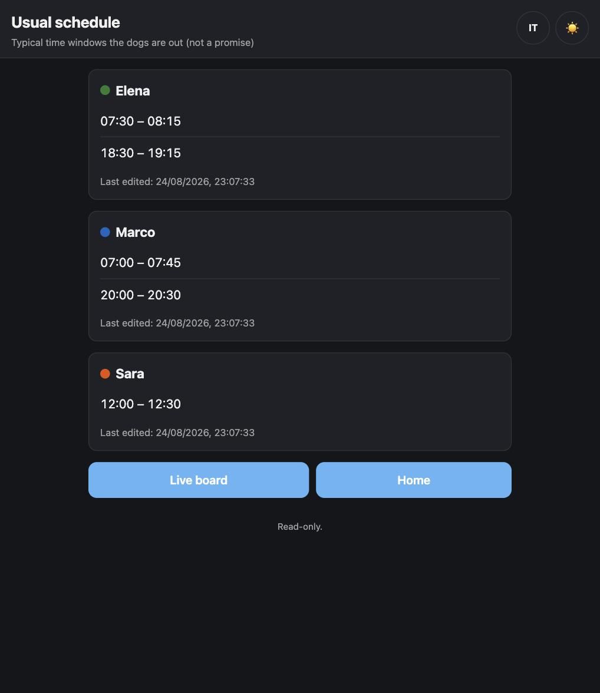

# DogWalkBoard 🐕

A small, self-hosted board for a group of neighbors who each walk a dog 🐾
and want to know — in something close to real time — whether the others are
out right now, roughly where, and where they're headed, so everyone can
route around each other (or perhaps join each other to play together).

No accounts, no database, no build step. Static HTML/JS plus a couple of
small PHP endpoints, deployable to any ordinary shared PHP hosting over plain
FTP. No shell access needed. 

## Screenshots

<table>
<tr>
<td width="50%"></td>
<td width="50%"></td>
</tr>
<tr>
<td align="center"><em>Home — pick who you are</em></td>
<td align="center"><em>Live board — everyone's live status</em></td>
</tr>
<tr>
<td width="50%"></td>
<td width="50%"></td>
</tr>
<tr>
<td align="center"><em>Your own page — status, GPS, planned route</em></td>
<td align="center"><em>Usual schedule — everyone's typical windows</em></td>
</tr>
</table>

*(Sample data from a demo deployment — not a real neighborhood.)*

## Features 🐶

- **Live status board** — see who's out right now, their live position and
  direction of travel on a map, updated by polling every 10 seconds.
- **Continuous GPS sharing** — while "Out now" and "GPS" are both on, your
  position is pushed automatically as you walk (throttled to at most once
  every 8 seconds). ⚠️ **This needs the page to stay open** — it's a browser
  tab polling and reporting position, not a background service or a native
  app, so if you close the tab or the browser fully kills it, sharing stops
  until you reopen it. Backgrounding the tab (screen off, switching apps)
  usually keeps GPS reporting on phones, but isn't guaranteed — that's
  exactly what the stale-position and "you were away" alerts below are for.
- **50m proximity alert** — a visible banner **and a distinct sound** when
  two active participants are close to each other; repeats every 10s while
  it stays true, stops the moment it isn't.
- **Walk started/stopped alert** — its own banner **and sound**, separate
  from the proximity one, the moment anyone's status flips — even with no
  proximity risk yet.
- **Stale-position warning** — if someone's position hasn't actually updated
  in 30+ seconds, their marker **blinks** on the map and their "last
  updated" time turns red — plus **its own beep**, once, exactly when it
  first goes stale (not repeated). 🐾
- **"You were away" alert** — if it's *your* page that was backgrounded, you
  get an unmissable modal (with sound) when you come back, telling you how
  long you were away and that your shared position may not have kept up.
- **Planned routes** — draw the route you intend to walk; it stays visible to
  everyone (including yourself, after saving) until it expires or you clear
  it.
- **Recurring schedules** — a simple read-only page listing everyone's
  typical daily walk windows, for when nobody's out right now.
- **Bilingual UI** (Italian/English) — a toggle in the header, next to the
  dark/light theme toggle, remembers your choice.
- **Any number of participants** — configure 2 or more, each with a name and
  a color picked from a palette during setup.

## Architecture

Static HTML/CSS/vanilla JS frontend (Leaflet.js + OpenStreetMap tiles for the
map), a handful of PHP endpoints that only ever *write* flat JSON files under
`webroot/data/` (all reads are plain cache-busted `fetch()` of those files —
no PHP involved), and file-locked read-modify-write so concurrent writes
never corrupt a record. No database, no build tooling, no framework: this
whole app is exactly what you upload.

Auth is intentionally minimal: each participant gets a private link
(`control.html?u=<id>`) with no secret token. This is meant for a small,
trusted group who don't publish their own links — see
[DEPLOYMENT.md](DEPLOYMENT.md) for the reasoning and its limits.

## Quick start

```sh
git clone <this-repo> DogWalkBoard
cd DogWalkBoard
bash bin/setup.sh
```

The wizard (plain bash — no PHP needed on your own machine, only on the
hosting you deploy to) asks for your neighborhood's map center, timezone,
and the list of participants — picking each one's color from a numbered
palette rather than typing a hex code — then generates the config and
starting data files. Upload the entire contents of `webroot/` to your
hosting via FTP and you're done.

See [DEPLOYMENT.md](DEPLOYMENT.md) for prerequisites, step-by-step
deployment, and troubleshooting.

## Author 🐕‍🦺

**Michele Giugliano** — vibecoded with Claude Sonnet 5.

## License

MIT — see [LICENSE](LICENSE).
